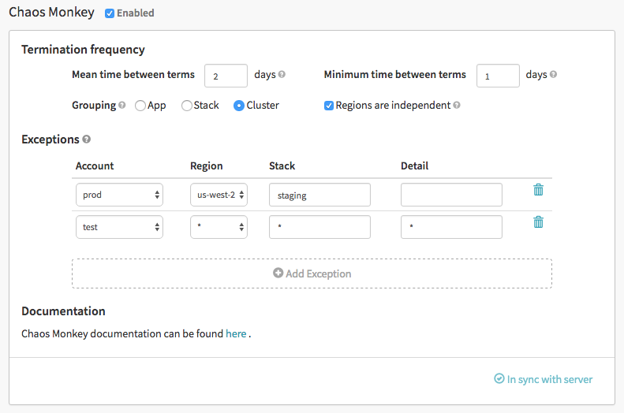

Through the Spinnaker web UI, you can configure how often Chaos Monkey
terminates instances for each application.

Click on the "Config" tab in Spinnaker. There should be a "Chaos Monkey"
widget where you can enable/disable Chaos Monkey for the app, as well as
configure its behavior.

## Termination frequency

By default, Chaos Monkey is configured for a *mean time between terminations* of
two (2) days, which means that on average Chaos Monkey will terminate an
instance every two days for each group in that app.

The lowest permitted value for mean time between terminations is one (1) day.

Chaos Monkey also has a *minimum time between terminations*, which defaults to
one (1) day. This means that Chaos Monkey is guaranteed to never kill more often
than once a day for each group. Even if multiple Chaos Monkeys are deployed, as
long as they are all configured to use the same database, they will obey the
minimum time between terminations.

### Grouping

Chaos Monkey operates on *groups* of instances. Every work day, for every
(enabled) group of instances, Chaos Monkey will flip a biased coin to determine
whether it should kill an instance from a group. If so, it will randomly
select an instance from the group.

Users can configure what Chaos Monkey considers a group.  The three options are:

* app
* stack
* cluster

If grouping is set to "app", Chaos Monkey will terminate up to one instance per
app each day, regardless of how these instances are organized into clusters.

If the grouping is set to "stack", Chaos Monkey will terminate up to one instance per
stack each day. For instance, if an application has three stacks defined, then
Chaos Monkey may kill up to three instances in this app per day.

If the grouping is set to "cluster", Chaos Monkey will terminate up to one
instance per cluster each day.

By default, Chaos Monkey treats each region separately. However, if the "regions
are independent" option is unchecked, then Chaos Monkey will not terminate
instances that are in the same group but in different regions. This is intended
to support databases that replicate across regions where simultaneous
termination across regions is undesirable.

## Exceptions

You can opt-out combinations of account, region, stack, and detail. In the
example config shown above, Chaos Monkey will not terminate instances in the
prod account in the us-west-2 region with a stack of "staging" and a blank
detail field.

The exception field also supports a wildcard, `*`, which matches everything. In
the example above, Chaos Monkey will also not terminate any instances in the
test account, regardless of region, stack or detail.
