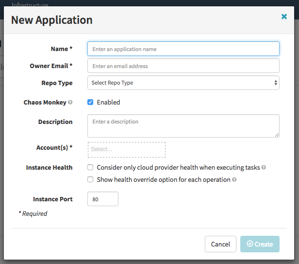

We currently don't have a streamlined process for deploying Chaos Monkey. This
page describes the manual steps required to build and deploy. A great way to
contribute to this project would be to use Docker containers to make it easier
for other users to get up and running quickly.

## Prerequisites

* [Spinnaker]
* MySQL (5.6 or later)

To use this version of Chaos Monkey, you must be using [Spinnaker] to manage your applications. Spinnaker is the
continuous delivery platform that we use at Netflix.

Chaos Monkey also requires a MySQL-compatible database, version 5.6 or later.

[Spinnaker]: http://www.spinnaker.io/


## Build

To build Chaos Monkey on your local machine (requires the Go
toolchain).

```
go get github.com/netflix/chaosmonkey/cmd/chaosmonkey
```

This will install a `chaosmonkey` binary in your `$GOBIN` directory.

## How Chaos Monkey runs

Chaos Monkey does not run as a service. Instead, you set up a cron job
that calls Chaos Monkey once a weekday to create a schedule of terminations.

When Chaos Monkey creates a schedule, it creates another cron job to schedule terminations
during the working hours of the day.

## Deploy overview

To deploy Chaos Monkey, you need to:

1. Configure Spinnaker for Chaos Monkey support
1. Set up the MySQL database
1. Write a configuration file (chaosmonkey.toml)
1. Set up a cron job that runs Chaos Monkey daily schedule

## Configure Spinnaker for Chaos Monkey support

Spinnaker's web interface is called *Deck*. You need to be running Deck version
v.2839.0 or greater for Chaos Monkey support. Check which version of Deck you are
running by hitting the `/version.json` endpoint of your Spinnaker deployment.
(Note that this version information will not be present if you are running
Deck using a [Docker container hosted on Quay][quay]).

[quay]: https://quay.io/repository/spinnaker/deck

Deck has a config file named `/var/www/settings.js`. In this file there is a
"feature" object that contains a number of feature flags:

```
  feature: {
    pipelines: true,
    notifications: false,
    fastProperty: true,
    ...
```

Add the following flag:

```
chaosMonkey: true
```

If the feature was enabled successfully, when you create a new app with Spinnaker, you will see
a "Chaos Monkey: Enabled" checkbox in the "New Application" modal dialog. If it
does not appear, you may need to deploy a more recent version of Spinnaker.



For more details, see [Additional configuration files][spinconfig] on the
Spinnaker website.

[spinconfig]: http://www.spinnaker.io/docs/custom-configuration#section-additional-configuration-files


## Create the MySQL database

Chaos Monkey uses a MySQL database as a backend to record a daily termination
schedule and to enforce a minimum time between terminations. (By default, Chaos
Monkey will not terminate more than one instance per day per group).

Log in to your MySQL deployment and create a database named `chaosmonkey`:

```
mysql> CREATE DATABASE chaosmonkey;
```

Note: Chaos Monkey does not currently include a mechanism for purging old data.
Until this function exists, it is the operator's responsibility to remove old
data as needed.

## Write a configuration file (chaosmonkey.toml)

See [Configuration file format](Configuration-file-format) for the configuration file format.

## Create the database schema

Once you have created a `chaosmonkey` database and have populated the
configuration file with the database credentials, add the tables to the database
by doing:

```
chaosmonkey migrate
```


### Verifying Chaos Monkey is configured properly

Chaos Monkey supports a number of command-line arguments that are useful for
verifying that things are working properly.

#### Spinnaker

You can verify that Chaos Monkey reach Spinnaker by fetching the Chaos Monkey
configuration for an app:

```
chaosmonkey config <appname>
```

If successful, you'll see output that looks like:

```
(*chaosmonkey.AppConfig)(0xc4202ec0c0)({
 Enabled: (bool) true,
 RegionsAreIndependent: (bool) true,
 MeanTimeBetweenKillsInWorkDays: (int) 2,
 MinTimeBetweenKillsInWorkDays: (int) 1,
 Grouping: (chaosmonkey.Group) cluster,
 Exceptions: ([]chaosmonkey.Exception) {
 }
})
```

If it fails, you'll see an error message.

#### Database

You can verify that Chaos Monkey can reach the database by attempting to
retrieve the termination schedule for the day.

```
chaosmonkey fetch-schedule
```

If successful, you should see output like:

```
[69400] 2016/09/30 23:41:03 chaosmonkey fetch-schedule starting
[69400] 2016/09/30 23:41:03 Writing /etc/cron.d/chaosmonkey-daily-terminations
[69400] 2016/09/30 23:41:03 chaosmonkey fetch-schedule done
```

(Chaos Monkey will write an empty file to
`/etc/cron.d/chaosmonkey-daily-terminations` since the database does not contain
any termination schedules yet).

If Chaos Monkey cannot reach the database, you will see an error. For example:

```
[69668] 2016/09/30 23:43:50 chaosmonkey fetch-schedule starting
[69668] 2016/09/30 23:43:50 FATAL: could not fetch schedule: failed to retrieve schedule for 2016-09-30 23:43:50.953795019 -0700 PDT: dial tcp 127.0.0.1:3306: getsockopt: connection refused
```

#### Generate a termination schedule

You can manually invoke Chaos Monkey to generate a schedule file. When testing,
you may want to specify `--no-record-schedule` so the schedule doesn't get
written to the database.

If you have many apps and you don't want to sit there while Chaos Monkey
generates a complete schedule, you can limit the number of apps  using the
`--max-apps=<number>`. For example:

```
chaosmonkey schedule --no-record-schedule --max-apps=10
```

#### Terminate an instance

You can manually invoke Chaos Monkey to terminate an instance. For example:

```
chaosmonkey terminate chaosguineapig test --cluster=chaosguineapig --region=us-east-1
```


### Optional: Dynamic properties (etcd, consul)

Chaos Monkey supports changing the following configuration properties dynamically:

* chaosmonkey.enabled
* chaosmonkey.leashed
* chaosmonkey.schedule_enabled
* chaosmonkey.accounts

These are intended to allow an operator to make certain changes to Chaos
Monkey's behavior without having to redeploy.

Note: the configuration file takes precedence over dynamic provider, so do
not specify these properties in the config file if you want to set them
dynamically.

To take advantage of dynamic properties, you need to keep those properties in
either [etcd] or [Consul] and add a `[dynamic]` section that contains the
endpoint for the service and a path that returns a JSON file that has each of
the properties you want to set dynamically.

Chaos Monkey uses the [Viper][viper] library to implement dynamic configuration, see the
Viper [remote key/value store support][remote] docs for more details.


[etcd]: https://coreos.com/etcd/docs/latest/
[consul]: https://www.consul.io/
[viper]: https://github.com/spf13/viper
[remote]: https://github.com/spf13/viper#remote-keyvalue-store-support


## Set up a cron job that runs Chaos Monkey daily schedule

### Create /apps/chaosmonkey/chaosmonkey-schedule.sh

For the remainder if the docs, we assume you have copied the chaosmonkey binary
to `/apps/chaosmonkey`, and will create the scripts described below there as
well. However, Chaos Monkey makes no explicit assumptions about the location of
these files.


Create a file called `chaosmonkey-schedule.sh` that invokes `chaosmonkey
schedule` and writes the output to a logfile.

Note that because this will be invoked from cron, the PATH will likely not include the
location of the chaosmonkey binary so be sure to specify it explicitly.

/apps/chaosmonkey/chaosmonkey-schedule.sh:
```bash
#!/bin/bash
/apps/chaosmonkey/chaosmonkey schedule >> /var/log/chaosmonkey-schedule.log 2>&1
```

### Create /etc/cron.d/chaosmonkey-schedule

Once you have this script, create a cron job that invokes it once a day. Chaos
Monkey starts terminating at `chaosmonkey.start_hour` in
`chaosmonkey.time_zone`, so it's best to pick a time earlier in the day.

The example below generates termination schedules each weekday at 12:00 system
time (which we assume is in UTC).

/etc/cron.d/chaosmonkey-schedule:
```bash
# Run the Chaos Monkey scheduler at 5AM PDT (4AM PST) every weekday
# This corresponds to: 12:00 UTC
# Because system clock runs UTC, time change affects when job runs

# The scheduler must run as root because it needs root permissions to write
# to the file /etc/cron.d/chaosmonkey-daily-terminations

# min  hour  dom  month  day  user  command
    0    12    *      *  1-5  root  /apps/chaosmonkey/chaosmonkey-schedule.sh
```

### Create /apps/chaosmonkey/chaosmonkey-terminate.sh

When Chaos Monkey schedules terminations, it will create cron jobs that call the
path specified by `chaosmonkey.term_path`, which defaults to /apps/chaosmonkey/chaosmonkey-terminate.sh

/apps/chaosmonkey/chaosmonkey-terminate.sh:
```
#!/bin/bash
/apps/chaosmonkey/chaosmonkey terminate "$@" >> /var/log/chaosmonkey-terminate.log 2>&1
```

